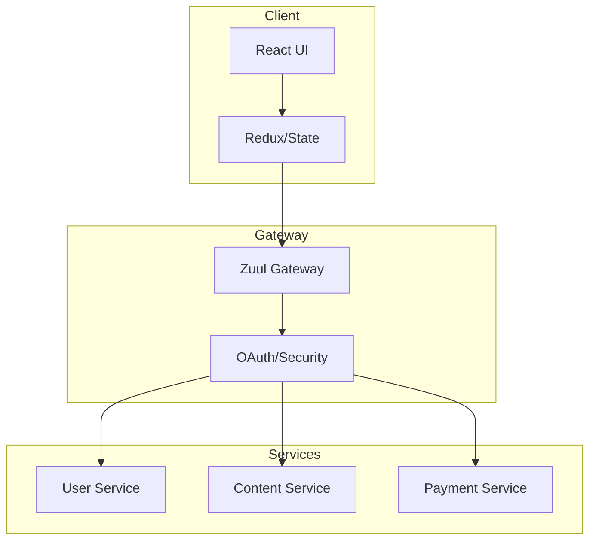
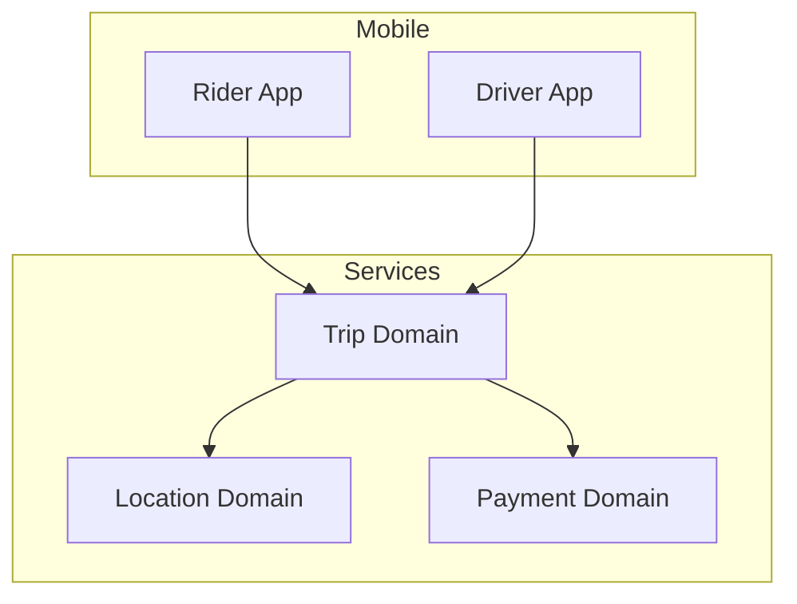
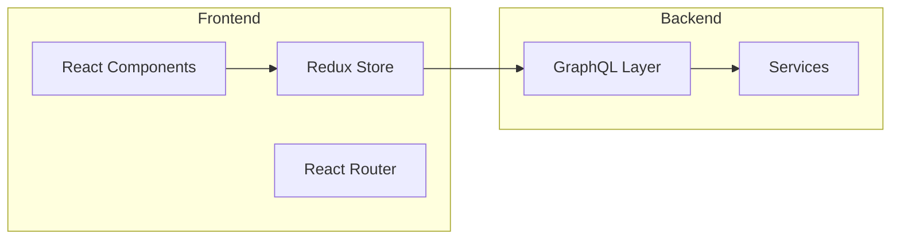
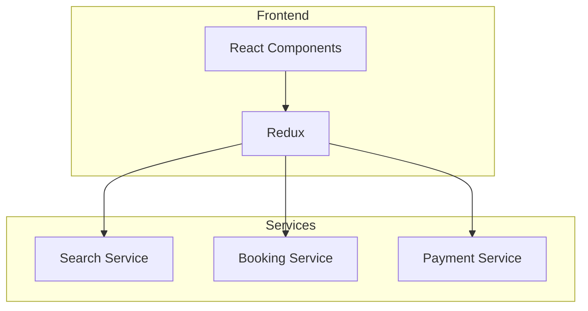

# Full Stack Flow Diagram Guide & Industry Patterns
Version: 2.0.0 (February 2025)

## Official Resources & Tools

### Diagram Creation Tools
1. **Enterprise Tools**
   - [Lucidchart Enterprise](https://www.lucidchart.com/pages/enterprise)
   - [Enterprise Architect](https://sparxsystems.com/products/ea/)
   - [Visual Paradigm](https://www.visual-paradigm.com/)

2. **Free/Open Source Tools**
   - [Draw.io](https://app.diagrams.net/)
   - [Mermaid Live Editor](https://mermaid.live/)
   - [PlantUML](https://plantuml.com/)

3. **Code-Based Diagram Tools**
   ```markdown
   npm install -g @mermaid-js/mermaid-cli
   npm install -g plantuml-generator
   ```

## Industry Standard Patterns

### 1. Netflix Microservices Pattern


**Resources:**
- [Netflix Technology Blog](https://netflixtechblog.com/)
- [Netflix OSS](https://netflix.github.io/)
- [Zuul Gateway](https://github.com/Netflix/zuul)

### 2. Uber's Domain-Driven Pattern


**Resources:**
- [Uber Engineering Blog](https://eng.uber.com/)
- [Domain-Driven Design](https://martinfowler.com/tags/domain%20driven%20design.html)

### 3. Meta's React Flow Pattern


**Resources:**
- [React Architecture](https://reactjs.org/docs/thinking-in-react.html)
- [Redux Best Practices](https://redux.js.org/style-guide/style-guide)
- [GraphQL Documentation](https://graphql.org/learn/)

## Common Design Patterns

### 1. Layered Architecture Pattern
```markdown
- Presentation Layer (React/Vue/Angular)
- API Gateway Layer
- Business Logic Layer
- Data Access Layer
```

**Implementation Resources:**
- [Microsoft Layered Architecture](https://learn.microsoft.com/en-us/azure/architecture/guide/architecture-styles/n-tier)
- [AWS Well-Architected](https://aws.amazon.com/architecture/well-architected/)

### 2. Microservices Pattern
```markdown
- Service Discovery
- API Gateway
- Circuit Breaker
- Event Sourcing
- CQRS
```

**Resources:**
- [Microservices.io Patterns](https://microservices.io/patterns/index.html)
- [Martin Fowler's Blog](https://martinfowler.com/articles/microservices.html)

### 3. Event-Driven Pattern
```markdown
- Event Bus
- Message Queues
- Pub/Sub Model
- Event Sourcing
```

**Resources:**
- [AWS Event-Driven](https://aws.amazon.com/event-driven-architecture/)
- [Azure Event Grid](https://learn.microsoft.com/en-us/azure/event-grid/)

## Real-World Examples

### 1. Airbnb's Architecture


**Reference:**
- [Airbnb Engineering](https://medium.com/airbnb-engineering)
- [React at Airbnb](https://medium.com/airbnb-engineering/react-at-airbnb-f95006e78c70)

### 2. Twitter's Architecture
```markdown
- Frontend: React.js
- API Layer: GraphQL
- Services: Microservices
- Storage: Manhattan (NoSQL)
```

**Resources:**
- [Twitter Engineering Blog](https://blog.twitter.com/engineering/en_us)
- [Twitter's Technical Blog](https://blog.twitter.com/engineering/en_us/topics/infrastructure)

## Design Tools & Standards

### 1. UML Tools
- [StarUML](https://staruml.io/)
- [Modelio](https://www.modelio.org/)
- [UMLet](https://www.umlet.com/)

### 2. Architecture Documentation
- [C4 Model](https://c4model.com/)
- [Arc42](https://arc42.org/)
- [View Model](https://www.viewpoints-and-perspectives.info/)

### 3. Code Generation Tools
- [Swagger Codegen](https://swagger.io/tools/swagger-codegen/)
- [OpenAPI Generator](https://openapi-generator.tech/)
- [GraphQL Code Generator](https://www.graphql-code-generator.com/)

## Best Practices

### 1. Diagram Standards
```markdown
- Clear layer separation
- Consistent color coding
- Proper labeling
- Flow direction indicators
- Component grouping
```

### 2. Documentation Requirements
```markdown
- Component descriptions
- Interaction flows
- Data flows
- Security boundaries
- Scale points
```

## Learning Resources

### 1. Online Courses
- [System Design Course](https://www.educative.io/courses/grokking-the-system-design-interview)
- [Software Architecture](https://www.coursera.org/learn/software-architecture)
- [Microservices Architecture](https://www.udemy.com/course/microservices-architecture-and-implementation)

### 2. Books
- "Clean Architecture" by Robert C. Martin
- "Building Microservices" by Sam Newman
- "Fundamentals of Software Architecture" by Mark Richards

### 3. GitHub Repositories
- [System Design Primer](https://github.com/donnemartin/system-design-primer)
- [Awesome System Design](https://github.com/madd86/awesome-system-design)
- [Software Architecture Books](https://github.com/mhadidg/software-architecture-books)

## Community Resources

### 1. Forums & Discussion
- [Software Engineering Stack Exchange](https://softwareengineering.stackexchange.com/)
- [Reddit r/softwarearchitecture](https://www.reddit.com/r/softwarearchitecture/)
- [Dev.to Architecture](https://dev.to/t/architecture)

### 2. Blogs & Newsletters
- [Martin Fowler's Blog](https://martinfowler.com/)
- [High Scalability](http://highscalability.com/)
- [Architecture Weekly Newsletter](https://github.com/oskardudycz/ArchitectureWeekly)

